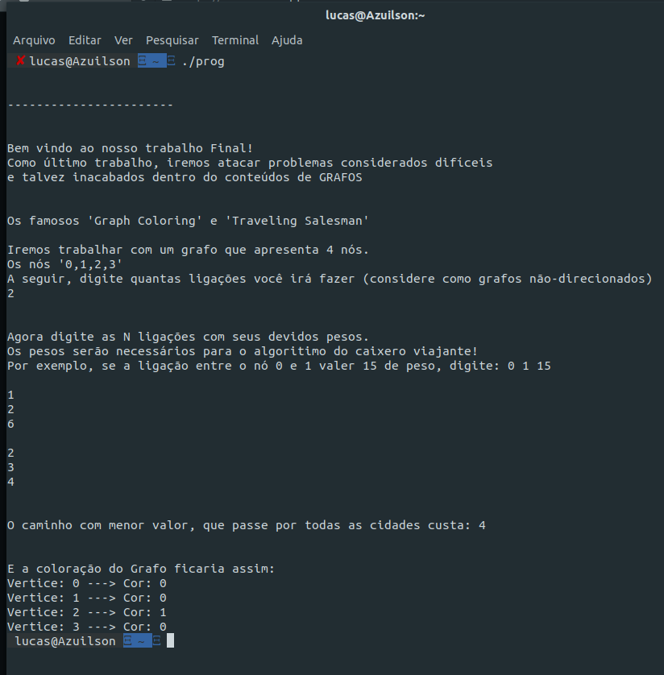
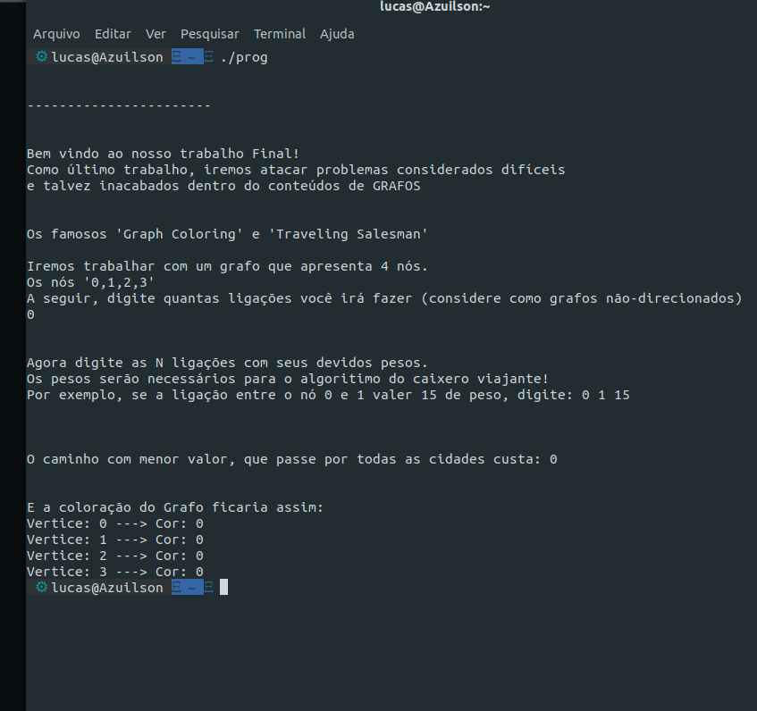
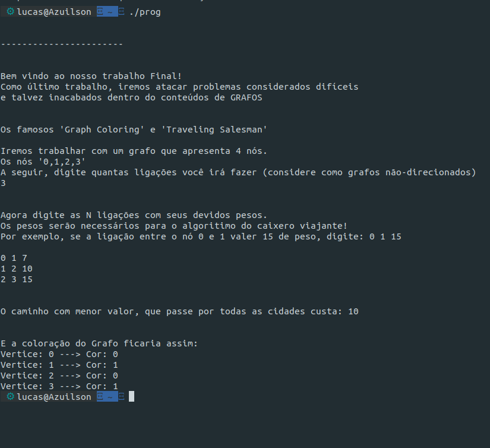

# Caixeiro Voador

**Número da Lista**: 6 
**Conteúdo da Disciplina**: Final

## Alunos
|Matrícula | Aluno |
| -- | -- |
| 17/0039668  |  Lucas Ganda Carvalho |
| 17/0047326  |  Wictor Bastos Girardi |

## Sobre 
O nosso projeto tem como intuito utilizar os conceitos e aplicação de Grafos para lidar com 2 caso/problemas famosos na computação, o do caixeiro viajante e o da coloração de grafos

## Screenshots
## Screenshots




## Instalação 
**Linguagem**: C++

Para a execucao do projeto basta apenas ter um compilador de C++ no sistema, para executa-lo no Linux, e necessario abrir o terminal e digitar os comandos :

```
g++ -o prog final.cpp
```


```
./ prog
```

Sendo primeiro para compilar o programa e o segundo para executa-lo
## Uso 
Apos a execucao do programa, e necessario apenas digitar quantas ligações você deseja no grafo, depois disso as ligações e o valor entre cada 1 delas.


